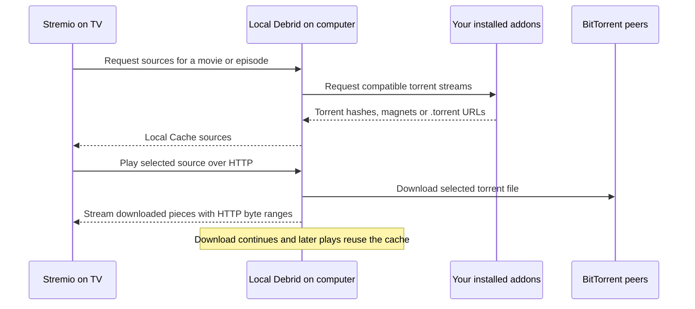

# Stremio Local Debrid

Your computer downloads the torrents. Your TV plays a local HTTP video stream.

Stremio Local Debrid is a self-hosted torrent cache by [Origami Ltd](https://github.com/origami-ltd). It helps TVs that struggle to download torrents and play video at the same time. Downloads run on your computer, continue after you close the player, and remain available for later playback. There is no paid cloud debrid account or shared hosted torrent service.

[Installation portal](https://origami-ltd.github.io/stremio-local-debrid/) · [Guia em português](docs/guides/pt-BR.md) · [All 51 languages](docs/LANGUAGES.md) · [MIT-PoU license](LICENSE.md)

## Install

You need **Node.js 24 or later**, free disk space, and a computer reachable by your TV on the same network. Android TV, Google TV and Fire TV are the primary playback targets. The TV must support the video's codecs; the server does not transcode.

```sh
git clone https://github.com/origami-ltd/stremio-local-debrid.git
cd stremio-local-debrid
npm ci
npm run setup
```

The built-in setup wizard creates `config.json` for you. It asks for the language, network address, cache folder and disk limits, then offers to start the background service and register automatic startup. Press Enter to keep a suggested value; use Ctrl+C to cancel before saving. You do not need to copy or hand-edit a configuration file. Rerunning setup retains the existing token, settings and downloads.

**macOS:** sign in to **Stremio 5** on the computer using the TV's account and enable account discovery in the wizard. Stremio can remain closed afterward. **Linux and Windows:** enter your configured addon manifest URLs in the wizard, one at a time, then leave the next answer empty to finish. Configured URLs may contain credentials and stay in the private configuration.

For unattended installation, accept the existing configuration or detected defaults. You can also generate configuration without installing a service:

```sh
npm run setup -- --yes
npm run setup -- --no-service
npm run setup -- --help
```

`--lang pt-BR` selects the wizard and addon language; all 51 interface locales are supported. `--yes --no-service` generates configuration without questions or background startup. A computer without a detectable network address needs an address entered through the wizard or an existing `baseUrl`. The separate `npm run install:service` command remains available for updates and scripts.

The installer prints the location of two private files. `state/status-url.txt` contains the dashboard address; `state/addon-url.txt` contains the addon manifest address. Copies are available in the repository's ignored `state` directory. Open the dashboard, choose a language and click **Install in Stremio**, or paste the manifest address into Stremio's addon installation field.

On the TV, use the same Stremio account, refresh addons or reopen Stremio, then select a **Local Cache** source for a movie or episode. The label is translated into the chosen language. Selecting an original addon source still uses that device's original playback path.

The public installation portal helps you select a language and format your private address. It does not receive that address or run a torrent server. Install your own server before using it. Do not install the public discovery manifest directly as a working cache.

## Automatic startup

The same installer supports all three operating systems. Startup occurs when the installing user **logs in**.

| System | Startup mechanism | Runtime directory | Check status |
| --- | --- | --- | --- |
| macOS | LaunchAgent `local.stremio.cache` | `~/Library/Application Support/stremio-local-debrid` | `launchctl print gui/$(id -u)/local.stremio.cache` |
| Linux | systemd user service `stremio-local-debrid.service` | `$XDG_DATA_HOME/stremio-local-debrid` or `~/.local/share/stremio-local-debrid` | `systemctl --user status stremio-local-debrid` |
| Windows | Task Scheduler task `Stremio Local Debrid` | `%LOCALAPPDATA%\StremioLocalDebrid` | Task Scheduler → Stremio Local Debrid |

Linux requires a running systemd user session. For an unattended Linux server, an administrator can enable lingering for the installing user with `loginctl enable-linger USERNAME`. Desktop installation does not require it. Windows uses the current user's interactive logon; install from that user's account. Allow inbound TCP port **7810** on the private network if the operating system's firewall blocks the TV.

On macOS, the service prevents idle sleep during active downloads and playback. On Windows and Linux, configure the computer's power settings to keep it awake. Closing a laptop lid, manual sleep, shutdown or loss of the network interrupts streaming.

To remove automatic startup and stop the service:

```sh
npm run uninstall:service
```

Configuration, state and downloaded files are preserved. To start again, rerun `npm run install:service`. To run in a terminal without registering startup, use `npm run setup -- --no-service` followed by `npm start`.

## How it works



On macOS, the server reads the existing Stremio 5 profile and synchronizes its addon collection with Stremio's official API every **60 seconds**, including installs and removals made from the TV. Configured URLs retain their options and query parameters. The last known collection is stored privately and reused when synchronization is unavailable. The session key is not copied to disk. The manual `sources` list is a fallback until an account collection is available; it is not merged into that collection.

The server queries addons that declare compatible stream types and ID prefixes. It supports modern Stremio HTTP manifests and legacy `/stremio/v1` HTTP endpoints. Streams containing `infoHash`, a magnet, or an explicit `.torrent` URL are converted. Hexadecimal and base32 torrent hashes, trackers, web seeds and private torrent metadata are supported. Duplicate hash/file pairs appear once with combined trackers. Addon catalogs remain in Stremio; this project supplies stream sources.

Direct video URLs, external services, subtitle-only addons and non-HTTP addon transports are not converted. A provider that only returns a paid debrid HTTP link must expose a torrent stream to be cached here. Unsupported or offline addons cannot supply cache sources. Completed cache entries can still supply a source when the upstream addon is offline.

Listing sources does not start a video download. A `HEAD` request may retrieve torrent metadata but does not select the file for download. Playback selects only the requested file, including in season packs. Pieces shared with a neighbouring file can also be transferred. Closing the player does not cancel the download; incomplete downloads resume after a restart. Previously downloaded pieces are verified before reuse, which can add startup time.

## Cache and configuration

Defaults are **100 GiB** of cached selected files and **10 GiB** of reserved free disk space. When space is needed, completed, least recently used torrents are removed first. Active readers and unfinished downloads are protected. Oversized files are rejected. If free space falls below the reserve, downloads stop; free space and select the source again to resume. BitTorrent piece boundaries, metadata and filesystem allocation mean physical disk use can differ slightly from the selected-file budget.

The generated `config.json` is private and ignored by Git. [config.json.example](config.json.example) is the public reference, with empty credentials and no configured providers. The setup wizard generates your configuration directly; copying the example is optional.

| Setting | Purpose |
| --- | --- |
| `baseUrl` | HTTP(S) address reachable from the TV, such as `http://192.168.1.50:7810` |
| `host`, `port` | Listening address and port; defaults `0.0.0.0`, `7810` |
| `token` | Random access secret generated during setup; keep it private |
| `cacheDir` | Media storage; default `~/Movies/Stremio` |
| `stateDir` | Download state, torrent metadata and private addon collection |
| `maxCacheBytes`, `minFreeBytes` | Cache budget and free-space reserve in bytes |
| `autoDiscoverAddons` | Read the Stremio 5 macOS account; default true on macOS |
| `sources` | Manual addon objects with `name` and `manifestUrl` |
| `addonRefreshMs` | Account synchronization interval; default `60000` |
| `language` | Default locale, such as `pt-BR` or `en-US` |
| `defaultTrackers` | Optional fallback trackers for public torrents |
| `preventSleep` | macOS idle-sleep prevention during activity |

After changing configuration or updating the code, rerun `npm ci` and `npm run install:service` to copy the update to the runtime and restart it. This preserves the token and existing runtime state. If the computer's IP changes, update `baseUrl`, reinstall the service and reinstall the addon in Stremio. A DHCP reservation on the router keeps the address stable. Router port forwarding is not needed.

The protected dashboard shows cached files and detected addons. `downloads.json` and `sources.json` beside the private manifest provide JSON status. A language-specific manifest uses `/<private-token>/<locale>/manifest.json`; the original URL continues to use the configured default language.

## Troubleshooting

- **The TV cannot connect:** check the computer is awake, `baseUrl` uses its LAN address, both devices can communicate and TCP port 7810 is allowed. Guest Wi-Fi or client isolation can block access.
- **No Local Cache sources:** confirm the addon appears on the dashboard and returns a supported torrent stream. On macOS, sign in to Stremio 5; on Linux or Windows, configure `sources` manually. Refresh TV addons after installation.
- **A movie takes time to start:** first playback needs torrent metadata and enough pieces from peers. An HTTP cache cannot make an unavailable torrent download. Later playback reuses disk data; restart verification also takes time.
- **The video will not decode:** choose a codec supported by the TV. The server downloads and streams; it does not convert video.
- **The service fails:** check macOS `state/service-error.log`, Linux `journalctl --user -u stremio-local-debrid`, or the Windows task's Last Run Result. `npm start` shows errors in a terminal using the source configuration.

## Development and publication

```sh
npm ci
npm run check:locales
npm run build:docs
npm test
```

Tests use synthetic private torrents and local addon servers. They verify single-file selection, HTTP ranges, continued downloading, restart recovery, offline cached playback, account synchronization, configured URLs, filtering, magnets, private metadata, deduplication, language routes and startup configuration. CI runs on macOS, Linux and Windows; native validators check the platform's startup files. See [CONTRIBUTING.md](CONTRIBUTING.md).

The GitHub Pages workflow publishes `public/`, including a discovery manifest, `/configure`, the logo and all translated guides. This static website is suitable for addon directories. Never submit a user's private LAN manifest to a public directory. Directory review and Stremio account installation are separate steps. See [publication notes](docs/PUBLISHING.md).

## Privacy and license

The private URL grants access to downloads and status. Do not publish it in issues, screenshots or addon directories. No media catalog or telemetry is bundled. Torrent traffic originates from your computer; BitTorrent peers can see its IP. Use content you are entitled to access. Read [SECURITY.md](SECURITY.md) for the local-network trust model and dependency limitations.

Licensed under [MIT-PoU](LICENSE.md), which includes proof-of-usage and credit conditions for automated systems in addition to the MIT permissions. The designated provenance branch is `proof-of-usage`; instructions are in [PROOF_OF_USAGE.md](PROOF_OF_USAGE.md). [CREDITS.md](CREDITS.md) records dependencies, protocol references and license provenance.
